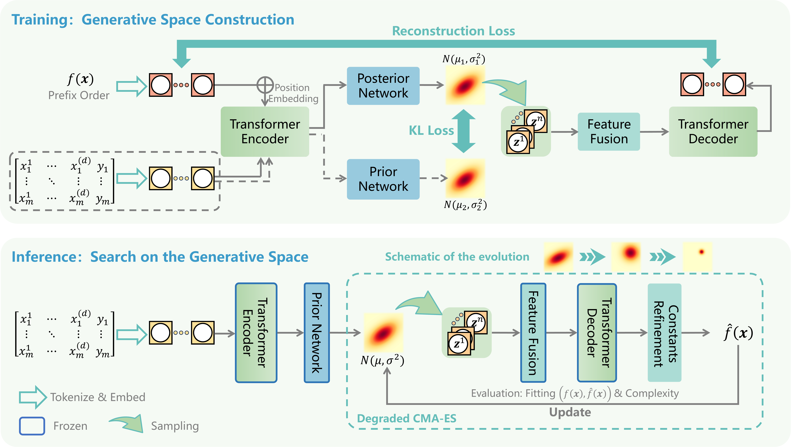

<div align="center">
  <h2><b> (ICLR'26) GenSR: Symbolic Regression Based on Equation Generative Space </b></h2>
</div>

The official implementation of our ICLR-2026 paper "**GenSR: Symbolic Regression Based on Equation Generative Space**" [[OpenReview](https://openreview.net/forum?id=8emIjwUQZg)] [[WandB](https://wandb.ai/yuxiao-hu-the-hong-kong-polytechnic-university/ICLR26-GenSR)].

```
@inproceedings{
li2026gensr,
title={Gen{SR}: Symbolic regression based on equation generative space},
author={Qian Li and Yuxiao Hu and Juncheng Liu and Yuntian Chen},
booktitle={The Fourteenth International Conference on Learning Representations},
year={2026},
url={https://openreview.net/forum?id=8emIjwUQZg}
}
```

## Introduction

<p align="center">

</p>

GenSR constructs an **equation generative space** via a Conditional Variational Autoencoder (CVAE), where each point in the latent space maps to a symbolic equation. At inference time, a **degraded CMA-ES** searches this space to find equations that best fit the observed data, with constants refined via BFGS. Specifically, GenSR first pretrains a dual-branch Conditional Variational Autoencoder (CVAE) to reparameterize symbolic equations into a generative latent space with symbolic continuity and local numerical smoothness. At inference, the CVAE coarsely localizes the input data to promising regions in the latent space. Then, a modified CMA-ES refines the candi- date region, leveraging smooth latent gradients.

## Usage

### Requirements

```bash
pip install -r requirements.txt
```

### Pretrained Weights

Download the checkpoint from [Google Drive](https://drive.google.com/file/d/1TbcRSzO3rGQBuJIPN5P6fQpYYEv4__K4/view?usp=sharing) and place it in `weights/`:

```
weights/checkpoint.pth
```

### Training

```bash
bash scripts/train.sh
```

### Evaluation

```bash
bash scripts/eval.sh
```

Change `DATA_TYPE` in the script to evaluate on different SRBench datasets: `feynman`, `strogatz`, or `blackbox`.

## Acknowledge

We appreciate the following repos for their valuable code:

[[Multimodal-Math-Pretraining](https://github.com/deep-symbolic-mathematics/Multimodal-Math-Pretraining)] [[End-to-end Symbolic Regression](https://github.com/facebookresearch/symbolicregression)]


## License

This repository is licensed under the MIT License.
